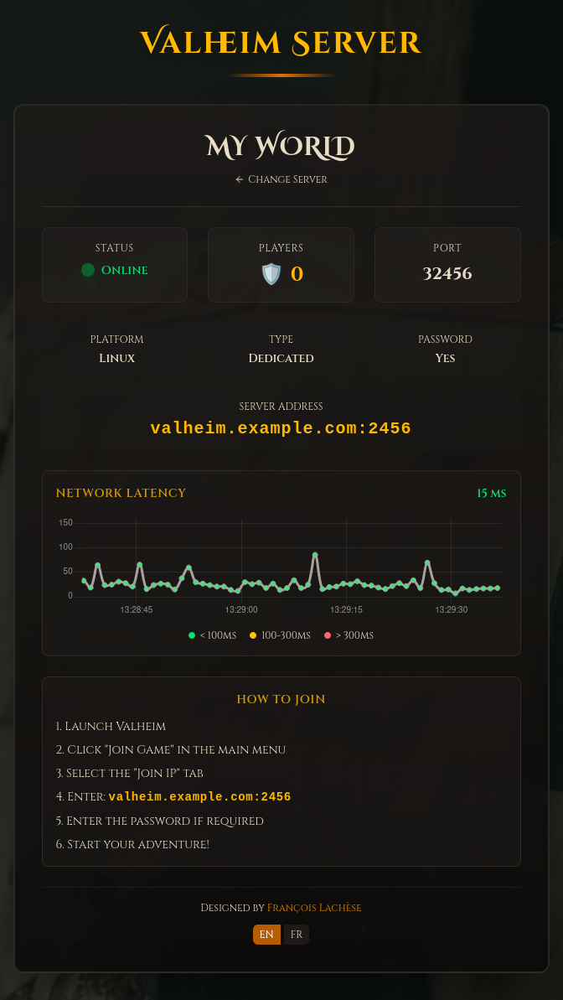

# Valheim Server Status

A beautiful, real-time status page for your Valheim game server. Keep your community informed about server availability, player count, and connection quality.

## Features

- **Live Server Status** - Instantly see if your server is online or offline
- **Player Count** - Track how many players are currently online
- **Real-time Latency Graph** - Monitor connection quality with a beautiful live chart
- **Server Details** - Display platform, type, password protection, and port information
- **Easy Connection** - Clear instructions for players on how to join your server
- **Multi-language Support** - Available in English and French
- **Responsive Design** - Works perfectly on desktop and mobile devices

## How to Use

Simply enter your server's API endpoint to get started. The page will automatically display:

- Current server status (online/offline)
- Number of active players
- Server address and connection details
- Live network latency monitoring
- Step-by-step instructions for players to join

## Demo

Check out the live demo: [https://flchs.github.io/ValheimStatus/](https://flchs.github.io/ValheimStatus/)

## License

MIT
